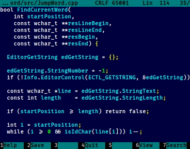

About
=====

The far2m plugin that searches the word under the cursor below or above the current location. This is quite useful for
quick navigation in sources. The demo is below:



Building
========

To build, do a git clone from this repository to your far2m source root folder, add `add_subdirectory(jumpword)` to
CMakeLists.txt, build far2m in the usual way.

Installing
==========

Perform the build and do the usual far2m installation from build directory.

In addition you can install <kbd>Ctrl</kbd> + <kbd>Alt</kbd> + <kbd>↓</kbd> and <kbd>Ctrl</kbd> + <kbd>Alt</kbd> +
<kbd>↑</kbd> keyboard shortcuts. To do that, add the following sections to `~/.config/far2m/settings/key_macros.ini`:

```ini
[KeyMacros/Editor/CtrlAltDown]
DisableOutput=0x0
Sequence=F11 j 2

[KeyMacros/Editor/CtrlAltUp]
DisableOutput=0x0
Sequence=F11 j 1

[KeyMacros/Editor/CtrlShiftDown]
DisableOutput=0x0
Sequence=F11 j 2

[KeyMacros/Editor/CtrlShiftUp]
DisableOutput=0x0
Sequence=F11 j 1
```
